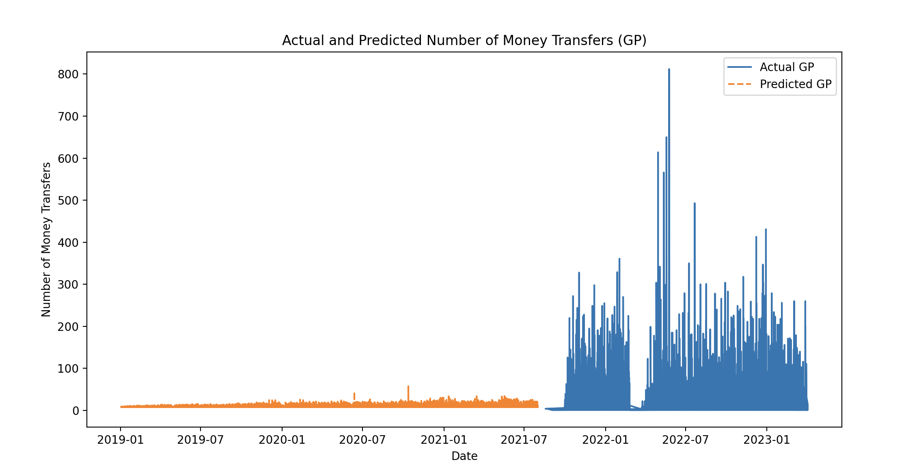
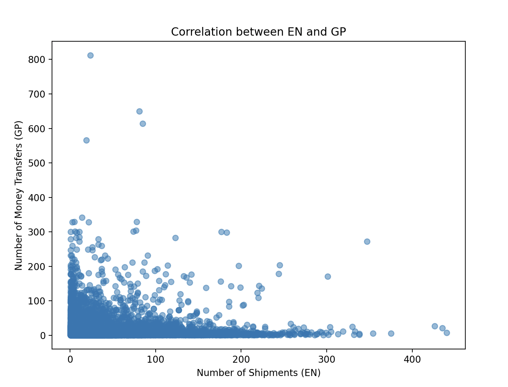

# How to run:
- Enter poetry env

    `$ poetry shell`
- Install dependencies

    `$ poetry install`
- Run main.py file

# The structure:
- __data_file/__ - intro data
- __readme_imgs/__ - imgs used for solution part in readme
- __utils/read_data.py__ - util to read csv data and group it
- __utils/\_\_init\_\_.py__ - initialisation of grouped data
- __main.py__ - entrypoint, main calculation

# Data description:
`***_en.csv` is the turnover of EN (shipments)

`***_gm.csv` is the number of money transfers (GP)

\
Files `***_en.csv`:
- Warehouse - department ID
- cargotype: 0 - up to 30 kg, 1 - more than 30 kg
- traffic_stream: 0 - OUT, sending; 1 - IN, receiving
- klk_EN: number of EN (shipments) per hour
- year - year
- month - month
- day - day
- hours - hours, 11-12 interval from 11 to 12

\
Files `***_gm.csv`:
- Year - year
- Month - month
- Day - day
- Hour - hour
- Warehouse - department ID
- Traffic_stream - 0 - OUT, sending; 1 - IN, receiving
- total_count - number of money transfers per hour
- total_sum - amount in UAH per hour, for receiving or sending a parcel

# The soluution:
## Results:

Pearson correlation coefficient: 0.08803649498783857

Spearman rank correlation coefficient: 0.25156353701301354

Based on the results there is no significant dependence between EN and GP. Furthermore, no dependence was detected between EN and total_sum, as the lack of transactions could be caused by more expensive parcels and by fewer count.